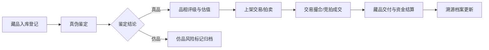

## 1. 产品概述

古钱币古玩鉴定交易系统是专为古玩商行打造的综合管理平台，集藏品入库、真伪鉴定、品相评级、交易撮合、客户管理、拍卖管理、溯源档案于一体，助力商行高效运营古玩鉴定与交易业务。

- 核心目标：实现古玩藏品全生命周期数字化管理，提升鉴定专业性与交易效率
- 目标用户：古玩商行经营者、鉴定专家、藏家客户
- 市场价值：标准化鉴定流程，可溯源交易体系，降低仿品风险

## 2. 核心功能

### 2.1 用户角色

| 角色 | 注册方式 | 核心权限 |
|------|----------|----------|
| 商行管理员 | 系统创建 | 全部功能权限，含用户管理与系统配置 |
| 鉴定专家 | 管理员添加 | 真伪鉴定、品相评级、出具鉴定证书 |
| 业务专员 | 管理员添加 | 藏品入库、交易撮合、客户管理、拍卖管理 |

### 2.2 功能模块

1. **藏品入库**：古玩藏品登记、藏品信息管理、仿品风险提示
2. **真伪鉴定**：专家鉴定意见、鉴定证书、鉴定历史记录
3. **品相评级**：品相成色评级、估值定价、评级标准参考
4. **交易撮合**：买卖撮合、交易记录查询、交易状态追踪
5. **客户管理**：藏家客户档案、客户等级、交易历史
6. **拍卖管理**：拍卖专场、保证金管理、竞拍记录
7. **溯源档案**：藏品流转溯源、完整档案查询、仿品风险预警

### 2.3 页面详情

| 页面名称 | 模块名称 | 功能描述 |
|----------|----------|----------|
| 藏品入库 | 藏品登记表单 | 录入藏品名称、朝代、材质、尺寸、来源、图片等基础信息 |
| 藏品入库 | 藏品列表 | 展示已入库藏品，支持搜索、筛选、分页 |
| 藏品入库 | 仿品风险提示 | 基于特征比对自动标记高风险仿品嫌疑 |
| 真伪鉴定 | 待鉴定列表 | 展示待鉴定藏品及其基础信息 |
| 真伪鉴定 | 专家鉴定面板 | 录入鉴定意见、真伪结论、鉴定依据、附件上传 |
| 真伪鉴定 | 鉴定证书 | 生成并展示电子鉴定证书，含编号、专家签章 |
| 品相评级 | 品评级量表 | 按十级制或五级制进行品相评定 |
| 品相评级 | 估值定价 | 根据品相、稀有度、市场行情给出估值区间 |
| 品相评级 | 评级标准 | 展示各等级品相的判定标准参考 |
| 交易撮合 | 买卖意向列表 | 展示买方与卖方的意向信息 |
| 交易撮合 | 撮合匹配 | 智能匹配买卖双方意向，生成撮合建议 |
| 交易撮合 | 交易记录 | 历史交易记录查询，支持多维度筛选 |
| 客户管理 | 客户档案列表 | 藏家客户基本信息、等级、联系方式 |
| 客户管理 | 客户详情 | 客户收藏偏好、交易历史、资金账户 |
| 客户管理 | 客户等级体系 | VIP等级、积分、权益管理 |
| 拍卖管理 | 拍卖专场列表 | 专场信息、开拍时间、拍品数量、状态 |
| 拍卖管理 | 拍品管理 | 上下架、起拍价、保留价、加价幅度设置 |
| 拍卖管理 | 保证金管理 | 保证金缴纳、冻结、退还流程 |
| 溯源档案 | 藏品时间轴 | 藏品从入库到历次交易的完整流转记录 |
| 溯源档案 | 档案详情 | 鉴定记录、交易记录、持有人变更等完整信息 |
| 溯源档案 | 风险预警 | 仿品风险、纠纷记录、异常交易提示 |

## 3. 核心流程

藏品从入库到交易的完整流程：藏品登记入库 → 真伪鉴定（出具证书）→ 品相评级与估值 → 上架交易/拍卖 → 买家下单/竞拍 → 交易撮合/成交 → 藏品流转溯源记录更新。

## 4. 用户界面设计

### 4.1 设计风格

采用**新中式古典**设计风格，融合传统文玩美学与现代交互体验：

- **主色调**：朱砂红（#B22222）作为品牌主色，象征古玩行的传统与厚重
- **辅助色**：古铜金（#C5A059）、墨玉黑（#1A1A1A）、宣纸米白（#F5F0E6）
- **中性色**：以暖灰系为主，营造温润雅致的视觉感受
- **按钮风格**：微圆角矩形，沉稳大气，悬停有微妙的光泽变化
- **字体**：标题使用具有书法感的衬线字体，正文使用清晰易读的无衬线字体
- **布局风格**：卡片式布局配合传统纹样边框点缀，左右分栏主内容区
- **装饰元素**：传统回纹边框、印章元素、水墨晕染背景纹理

### 4.2 页面设计概览

| 页面名称 | 模块名称 | UI元素 |
|----------|----------|--------|
| 藏品入库 | 登记表单 | 两列布局表单、图片上传区、朱砂红提交按钮、古铜金装饰边框 |
| 藏品入库 | 藏品列表 | 卡片式网格布局、藏品缩略图、标签徽章（真品/待鉴定/仿品）、悬停放大效果 |
| 真伪鉴定 | 鉴定面板 | 左侧藏品详情、右侧鉴定意见编辑区、专家签章区、证书预览 |
| 真伪鉴定 | 证书展示 | 仿宣纸质感背景、传统边框纹样、电子印章、可打印导出 |
| 品相评级 | 评级量表 | 十级进度条样式、当前等级高亮、古铜金渐变指示 |
| 交易撮合 | 撮合列表 | 买卖双方信息对比卡片、匹配度百分比、成交状态徽章 |
| 客户管理 | 客户档案 | 头像卡片、等级徽章（金/银/铜）、交易统计数据面板 |
| 拍卖管理 | 专场列表 | 倒计时组件、拍品进度条、保证金状态标签 |
| 溯源档案 | 时间轴 | 垂直时间轴布局、节点图标（入库/鉴定/交易）、连接线渐变 |

### 4.3 响应式

采用桌面端优先设计，适配 1280px 及以上屏幕宽度。主要内容区域最小宽度 1024px，侧边导航在平板端可收起，移动端简化为底部标签栏。

### 4.4 动效与交互

- 页面切换采用淡入淡出过渡
- 卡片悬停微上浮 + 阴影加深
- 时间轴节点滚动渐入
- 数据统计数字滚动动画
- 按钮点击有波纹反馈效果
