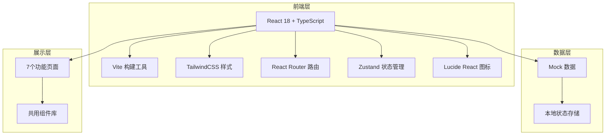
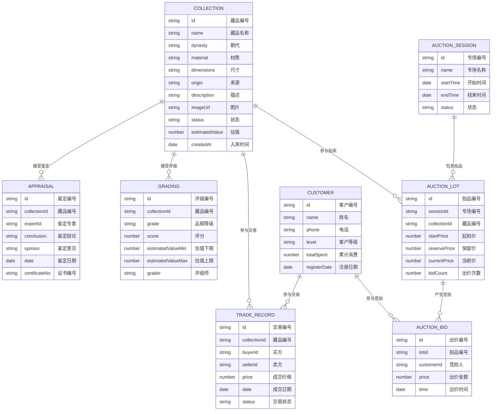

## 1. 架构设计



## 2. 技术描述

- **前端框架**：React 18 + TypeScript
- **构建工具**：Vite 5
- **样式方案**：TailwindCSS 3
- **路由管理**：React Router v6
- **状态管理**：Zustand
- **图标库**：Lucide React
- **后端**：无后端，使用 Mock 数据模拟
- **数据存储**：前端本地状态 + localStorage 持久化

## 3. 路由定义

| 路由路径 | 页面名称 | 说明 |
|----------|----------|------|
| /collection | 藏品入库 | 藏品列表与登记入库 |
| /authentication | 真伪鉴定 | 鉴定管理与证书生成 |
| /grading | 品相评级 | 品相评定与估值定价 |
| /trading | 交易撮合 | 买卖意向与交易撮合 |
| /customers | 客户管理 | 藏家客户档案管理 |
| /auction | 拍卖管理 | 拍卖专场与保证金管理 |
| /traceability | 溯源档案 | 藏品流转溯源查询 |

## 4. 数据模型

### 4.1 核心数据实体



## 5. 项目结构

```
src/
├── components/          # 共用组件
│   ├── Layout.tsx       # 布局组件（侧边栏+顶栏）
│   ├── PageHeader.tsx   # 页面标题
│   ├── StatCard.tsx     # 数据统计卡片
│   ├── CollectionCard.tsx # 藏品卡片
│   ├── StatusBadge.tsx  # 状态标签
│   └── Modal.tsx        # 弹窗组件
├── pages/               # 页面组件
│   ├── Collection.tsx   # 藏品入库
│   ├── Authentication.tsx # 真伪鉴定
│   ├── Grading.tsx      # 品相评级
│   ├── Trading.tsx      # 交易撮合
│   ├── Customers.tsx    # 客户管理
│   ├── Auction.tsx      # 拍卖管理
│   └── Traceability.tsx # 溯源档案
├── store/               # 状态管理
│   └── useStore.ts      # Zustand store
├── data/                # Mock 数据
│   └── mockData.ts      # 模拟数据
├── types/               # 类型定义
│   └── index.ts         # 类型声明
├── utils/               # 工具函数
│   └── format.ts        # 格式化工具
├── App.tsx              # 应用入口
├── main.tsx             # 渲染入口
└── index.css            # 全局样式
```

## 6. 主题配置

### 6.1 颜色系统

Tailwind 自定义颜色：

| 颜色名称 | 色值 | 用途 |
|----------|------|------|
| vermilion | #B22222 / #8B1A1A / #DC143C | 主色调（朱砂红） |
| bronze | #C5A059 / #A68B3D / #D4B87A | 古铜金辅助色 |
| ink | #1A1A1A / #2D2D2D / #404040 | 墨玉黑文字 |
| paper | #F5F0E6 / #EDE5D3 / #FAF7F0 | 宣纸米白背景 |
| warm-gray | #8B8680 / #A9A49D / #C8C4BF | 暖灰色系 |

### 6.2 字体系统

- 标题字体：'Noto Serif SC', 'Source Han Serif CN', serif
- 正文字体：'Noto Sans SC', 'PingFang SC', 'Microsoft YaHei', sans-serif
